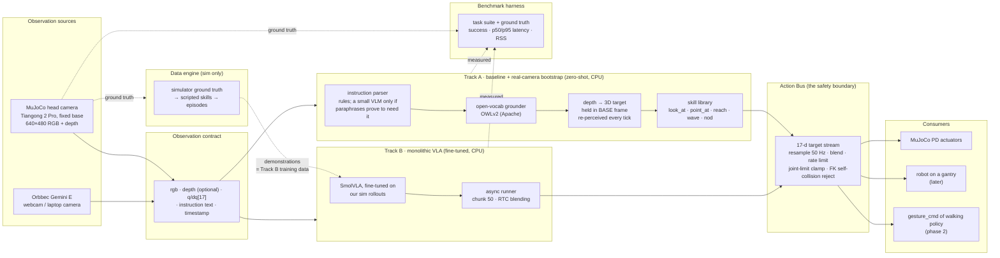

# Humanoid Perception for Edge — a CPU-first vision-language-action layer for TerminatorLite

Status: **approved 2026-10-08; M0 built.** Written 2026-10-08.
Companion work, both private and both structure references only: a locomotion training
platform for our own humanoid (this layer will feed its policies one day) and an earlier
RGB-D perception bench (its lessons are used, its code is not).

**Public by design.** This repository is meant to be open-sourced. It therefore contains
only publicly available data: the body it simulates is the published Tiangong 2.0 Pro, and
our own robot's design never enters the repository or its history. A private body plugs in
through a gitignored `private/` folder (§9).

---

## 0. In one sentence

Give TerminatorLite eyes and ears that run on a laptop CPU: a camera, a language instruction and a
small open model in, a smooth stream of upper-body joint targets out — first on a standing
robot in MuJoCo, then on the real camera, then on the real robot, and only at the very end
on a Jetson.

The claim we are setting out to prove: **a VLA does not need a GPU when (1) the action space
is the one the robot's existing controllers already consume, (2) inference is asynchronous
and action-chunked so the control loop never waits for it, and (3) the model is small and
quantised.** Each of those three is a design decision in this plan, not a hope.

---

## 1. Decisions already taken (2026-10-08)

| # | Decision | Reason |
|---|---|---|
| D1 | Both goals at once: **(a)** benchmark open VLAs on CPU, **(b)** build a VLA that drives TerminatorLite. | Decided 2026-10-08. (a) alone cannot move TerminatorLite — every public VLA is trained on another embodiment and no humanoid dataset in our joint space exists (§7). (b) without (a) has no numbers. |
| D2 | **Standing humanoid first.** Base is held: a fixed base in simulation, a gantry on hardware. Navigation comes after. | Decided 2026-10-08. It removes the RL policy from the loop entirely for phase 1 — there is no trained checkpoint for any 30-DoF robot yet — and makes the action space the 17 upper-body joints, the same shape as the arm VLAs that exist in the open. |
| D3 | **The body is the public Tiangong 2.0 Pro** (Open X-Humanoid URDF release, OpenAtom Open Hardware License 1.0): 30 joints — legs 12, waist 1, head 3, arms 7 + 7 — with a head camera link, an IMU and a with-hands variant. Standing phase: legs locked, pelvis bolted. Our own robot is **not** in the repository; it plugs in privately — and **it is the live test target**: the VLA control is validated on our humanoid in the lab, loaded from `private/`, while the Tiangong is what the open repository and its tests run on. | Decided 2026-10-08 (revised the same day from "our own robot" once the repository was declared public-by-design). Our robot shares the Tiangong's upper-body joint names, so the contract in §3 is written once and nothing in the code changes between the two; `tests/test_private_body.py` runs the same gate on it wherever `private/` exists. See §8. |
| D4 | Compute order: **CPU i5 → CPU i7 → Jetson Orin Nano last.** No local GPU, ever. Training on Kaggle. | Decided 2026-10-08. Every latency number in this plan is measured on this i5-10210U unless marked otherwise. |
| D5 | **The camera is the Orbbec Gemini E**, on every body, in simulation and in the lab; webcams only for RGB smoke tests. Sim first anyway. | Decided 2026-10-08. One camera model end to end means sim images and real images share intrinsics, range and failure modes; the sim gives ground truth, the camera does not. |
| D6 | Licences: commercial-friendly preferred; research-only acceptable for comparison models. | Decided 2026-10-08. Every model below carries its licence (§7). Anything non-commercial is a *comparison* entry, never on the path to the robot. |
| D7 | Private GitHub repo `Humanoid_Perception_for_Edge` under `shivpratapsinghpanwar`; new `uv` environment, Python 3.12. | Decided 2026-10-08. 3.12 matches the workspace venv; the system Python is 3.10. |
| D8 | **The VLA never sits inside the 50 Hz control loop.** | Our own measurement on our locomotion work: an unmodelled 45 ms actuation delay took a walking policy from 0 % to **100 % falls**. Perception writes goals into a buffer; the loop never blocks on it. |
| D9 | Our own humanoid is called **TerminatorLite** in prose only. Joint and body names are **not** renamed from the URDFs, and no code carries a robot's name. | Renaming joints breaks any downstream controller that resolves joints by name; keeping names out of code makes a rename a documentation edit. |
| D10 | **The VLA covers perception.** Vision, language and action are one system here; there is no separate "perception module" handed to a VLA. The earlier bench's perception (a detector plus depth refinement) was a deliberate, primitive stop-gap and is **not inherited** — the sibling projects are structure references only. The bar is the frontier labs' VLAs; what this project competes on is edge (CPU) engineering and novelty, not redoing the simple version. | Decided 2026-10-08. What *is* reused is simulation plumbing only: how a ROS URDF is loaded into MuJoCo without being silently wrong (§8). |
| D11 | **Public by design.** Only publicly available data goes into the repository: the Tiangong 2.0 Pro and open models. Our robot's URDF, meshes, gains and hardware notes live in the gitignored `private/` folder and are purged from git history. | Decided 2026-10-08. The edge-VLA work is meant to be open-sourced so others can use it; the robot design is not. |

The load-bearing assumption, confirmed 2026-10-08: **"standing" means the base does not
move.** Fixed base in sim (legs locked, pelvis bolted just above the floor), a gantry or
stand on hardware. Self-balancing while gesturing would need a gesture-conditioned walking
policy trained first, ~30 Kaggle GPU-hours before any perception work could show on a robot.

---

## 2. Facts we are planning around

**This machine.** Intel i5-10210U, 4 cores / 8 threads, 1.6 GHz base, AVX2 and no VNNI, 15.8 GB
RAM, Intel UHD iGPU, Windows 11. Free disk: 25 GB on D:, 39 GB on C: (where the Hugging Face
cache already holds 8 GB). Offscreen `mujoco.Renderer` works here; plain MuJoCo steps a
30-DoF humanoid in about a millisecond.

**The controllers this will one day feed.** Our locomotion policies (private) observe
`gyro 3 | gravity 3 | command 3 | phase 2 | q N | dq N | last action N` at 50 Hz and emit
joint position targets; the motor board runs the PD law. On hardware the only high-level
input today is a joystick's axes. A 17-joint upper-body "gesture command channel" is
designed but not implemented: `T × 17` targets at 50 Hz, offsets from the home pose, blended
in and out.

**What open VLAs cost on a CPU today.** The only zoo-wide CPU benchmark is the `vla.cpp`
README (Oct 2026, ggml backend, Q8/Q4 GGUF). Minimum latency per query, in ms:

| Device | Octo-Small | SmolVLA | GR00T N1.7 | Evo-1 | π0.5 |
|---|---|---|---|---|---|
| i7-14700F desktop | 40 | 1 689 | 1 453 | 4 160 | 6 068 |
| i5-12400F desktop (nearest to ours) | 78 | **2 288** | 1 974 | 5 435 | 8 638 |
| Core Ultra X7 358H, OpenVINO-CPU | — | 1 943 | 2 035 | 4 497 | 7 026 |
| Jetson Orin Nano Super, CUDA | 32 | 463 | 272 | 1 012 | 850 |

Nobody has measured an i5-10210U. Expect **≥ 1.5× the i5-12400F row**: a SmolVLA chunk of 50
actions in roughly 3.5–4.5 s. That rules out a synchronous 1–3 Hz monolithic VLA on this CPU.
It does **not** rule out the project: a 50-step chunk is one second of motion at 50 Hz, and
asynchronous chunked execution (LeRobot's async inference / real-time chunking) was built for
exactly this ratio. A second paper (`vla.simd`, fp32 SIMD) reports SmolVLA ~2.4× faster on the
same desktop chips; the two disagree and we will measure rather than pick.

**Which VLA can we actually train.** Kaggle gives ~30 GPU-hours a week on a T4 (16 GB, no bf16).
**SmolVLA** (450 M parameters, Apache-2.0) is the only open VLA with a demonstrated single-T4
fine-tune (~5 h for 10 k steps at batch 8, encoders frozen). Every 3B-class model (π0.5, GR00T
N1.7, EO-1, X-VLA full fine-tune) wants 24–40 GB. So Track B below is SmolVLA first, others as
comparison if they fit.

**Humanoid data.** There is no public dataset in a head-3 + arms-14 joint space. The nearest
are Unitree's G1 Dex3 sets (14 arm joints + 14 hand, Apache-2.0, no head) and NVIDIA's GR1
upper-body sim subsets (CC-BY-4.0). **Our training data has to come from our own simulator**,
which is why the ground-truth data engine (§5) exists before Track B.

---

## 3. The one contract: a 17-number action stream

Every component in this project, whichever model is behind it, produces the same thing:

```
upper_body_target[17]   radians, OFFSETS FROM HOME, contract order:
  head_yaw head_pitch head_roll
  shoulder_pitch_r shoulder_roll_r shoulder_yaw_r elbow_pitch_r elbow_yaw_r wrist_roll_r wrist_pitch_r
  shoulder_pitch_l shoulder_roll_l shoulder_yaw_l elbow_pitch_l elbow_yaw_l wrist_pitch_l wrist_roll_l
```

(our own canonical order, symmetric left/right, resolved **by joint name** against whichever
body is loaded — URDFs list the left wrist pair in different orders, so order is never
assumed from the file). Two optional extension channels ride beside it when the body has them
motorised: `waist[1]` (`body_yaw_joint` on the Tiangong; whatever a private body calls it)
and `hands[12]` (thumb 2 + index/middle/ring/little 1 per hand; the remaining finger joints
are mimics). The stream is delivered to an **Action Bus** that resamples it to 50 Hz,
blends, rate-limits, clamps to joint limits, rejects self-collisions, and hands it to
whatever is downstream:

| downstream | when | what the bus writes |
|---|---|---|
| MuJoCo, fixed base, PD actuators | phase 1, sim | `ctrl` for the 17 upper-body actuators |
| A robot on a gantry, legs held at HOME by its own board | phase 1, robot | joint targets + gains for the 17 joints through the robot's low-level interface |
| The gesture-conditioned walking policy | phase 2 | the 17-number `gesture_cmd` observation term, unchanged |
| Navigation | phase 3 | a second, 3-number stream: the velocity command |

**This is why standing-first is not a detour.** The stream is byte-for-byte the gesture
command channel the walking policy is designed to take. Nothing built for the standing robot
is thrown away when the legs arrive; a second 3-number stream is added beside it.

---

## 4. Architecture



Four rules the diagram encodes:

0. **One system: the VLA is the product and it covers perception.** Track B is literal — one
   network from pixels and text to the 17-d stream. A vision-language model on its own
   (SmolVLM, Moondream and the like) outputs text, cannot drive a motor and does not reason
   about actions; none of them is on the path to the robot. Track A's grounder, depth lift
   and base-frame **scene state** (objects with class, confidence, 3D position in the base
   frame, timestamp) exist for two reasons only: a zero-shot **baseline** the VLA has to beat
   on the same suite, and a **bootstrap on real camera images** before the VLA is trained,
   where there is no ground truth to lean on. Every module is written here from scratch;
   nothing is taken from the earlier simulator's perception. The bar is the frontier VLAs;
   the edge is CPU engineering and novelty (§5.4).
1. **Two tracks, one bus, one benchmark.** Track A and Track B are interchangeable behind the
   bus and are scored by the same harness. That is how (a) and (b) in D1 become one project.
2. **The data engine is simulator ground truth, not perception.** Scripted skills driven by
   the simulator's exact object poses generate the demonstrations SmolVLA is fine-tuned on;
   no VLM and no detector sits in that loop. There is no other source of 17-joint humanoid
   data (§2).
3. **The bus is where safety lives.** Limits, rates and self-collision are enforced once, for
   every model, in one place, at runtime.

Two lessons carried over from the earlier bench: targets are expressed
in the **robot base frame**, never the camera frame, because the head moves; and the target is
**re-perceived every tick** rather than tracked, because the tracker lost the cup the moment
the head turned.

---

## 5. Two tracks and the benchmark that compares them

### 5.1 The task suite (fixed before either track exists)

A standing robot at a table with 3–6 objects from a small vocabulary (cup, bottle, box, can,
ball; colours vary), scene randomised per episode. Instructions are templated with held-out
paraphrases for evaluation.

| task | instruction example | success metric (from sim ground truth) |
|---|---|---|
| look_at | "look at the red cup" | angle between camera optical axis and object centre < 5° for 1 s |
| point_at | "point at the bottle" | ray from hand frame passes within 5 cm of object centre, held 1 s |
| reach | "reach toward the box" | hand frame within 8 cm of a pre-grasp pose above the object; no self-collision |
| wave | "wave hello" | trajectory within tolerance of the reference wave; no self-collision; smoothness bound |
| nod / shake | "nod yes" / "shake your head no" | head pitch / yaw oscillation of the right sign and amplitude |
| idle | "stay still" | motion energy below threshold (the instruction-following control) |

Metrics recorded for every run: success rate per task, **p50 / p95 latency per tick on this
machine**, peak RSS, actions per second actually delivered to the bus, number of bus rejections
(limit / rate / collision), success on held-out phrasings.

### 5.2 Track A — the baseline, and the real-camera bootstrap

`instruction + rgb + depth` → a **rule-based parser** picks the skill and the object noun
(the suite is templated, so rules cover it) → an open-vocabulary **grounder** (OWLv2,
Apache-2.0) localises the object → depth lifts it to 3D in the base frame → the skill
generates a min-jerk 17-joint trajectory → bus. Expected tick: a few hundred ms for
grounding; the skill keeps the robot moving between ticks. This is the first loop that works
end-to-end on the CPU, and it is the yardstick: a VLA that does not beat it has not earned
its place.

A small VLM (SmolVLM2, which is also SmolVLA's own backbone) is **not** part of Track A by
default. It is added only if paraphrase robustness is measured to need it, and then as a
parser, never as a controller — it emits text, not actions.

### 5.3 Track B — monolithic, fine-tuned

SmolVLA fine-tuned on Kaggle on episodes recorded from the scripted skills driven by simulator
ground truth (plus noise and randomisation), action = the 17-d stream in 50-step chunks, state = q[17], image = head camera,
language = the instruction. Runs on the CPU through an async runner: a chunk is requested
when the queue drops below ~60 %, overlapping chunks are blended. Dataset in LeRobot v3 format
so the same data can train Evo-1 / X-VLA / MolmoAct2 for comparison without conversion.
T4 has no bf16: fp16 autocast or fp32 at batch 4–8 with encoders frozen.

### 5.4 Optimisation track (after both tracks exist)

Known: OpenVINO int8 / int4 weight-only for SmolVLA's backbone and the grounder; `vla.cpp` GGUF Q8/Q4 for
SmolVLA if it builds on Windows; ONNX Runtime
as the ARM fallback. **Audit every int8 export** — one published SmolVLA "int8" artefact turned
out to be a byte-identical fp32 graph.

Hypotheses worth testing because a standing robot's scene barely changes between ticks (each
gated on a measurement, none promised): skip the vision encoder when the frame has not changed
(frame-difference or embedding-distance gate); reuse the language KV cache across ticks since
the instruction is constant; prune visual tokens before the LLM. No published VLA system does
any of these at inference; if one of them gives a real speed-up it is a result in its own right.

---

## 6. Milestones and gates

| # | Milestone | Deliverable | Gate (measured, not asserted) | Effort |
|---|---|---|---|---|
| M0 | **Bootstrap** | repo, `uv` env, the Tiangong 2 Pro vendored with provenance, licence and hash manifest, loader (legs locked, pelvis bolted with automatic floor clearance, mimics as constraints when a body has them), head `<camera>` on `camera_head_link`, PD holds HOME, first rendered frame, pytest | robot holds HOME for 60 s, drift < 1°; render 640×480 RGB+depth from the head camera; each TCP where the URDF puts it; tests green | 1–2 days |
| M1 | **CPU latency census** | `docs/BENCHMARKS.md` with p50/p95 and RSS on this i5, in this order: **SmolVLA-base first** (a latency probe — its actions mean nothing on our body — but the one number that can change the architecture), then SmolVLM2-500M (measured only because it is the backbone inside SmolVLA, so its cost is the VLA's floor), then the grounders OWLv2 and YOLOE; fp32 vs OpenVINO int8 vs GGUF where available | numbers exist for every row; Track B's async parameters (chunk size, request threshold) chosen from the measured SmolVLA p50 | 2–3 days |
| M2 | **World + task suite + bus** | table scene, object vocabulary, randomiser, ground-truth API, the six tasks and their metrics, the Action Bus with limits / rate / FK self-collision | a scripted oracle (uses ground truth directly) scores ~100 % on all tasks through the bus; a deliberately bad trajectory is rejected by the bus | 3–4 days |
| M3 | **Track A end-to-end (the baseline)** | rule parser + grounder + depth lift + skills, running asynchronously against the 50 Hz sim | success ≥ 80 % on look_at / point_at / nod / wave on the templated suite; the control loop never stalls (jitter < 2 ms) while the grounder runs. Held-out paraphrases are the VLA's exam (M5), not the baseline's | 1 week |
| M4 | **Data engine** | episode recorder → LeRobot v3 dataset from Track A skills with randomisation; Kaggle packaging | ≥ 2 000 episodes rendered on this CPU; dataset loads in LeRobot; a 2-iteration CPU smoke train runs | 3–4 days |
| M5 | **Track B** | SmolVLA fine-tuned on Kaggle, exported, run on CPU through the async runner; same harness as M3 | side-by-side table A vs B on the suite; B delivers ≥ 10 actions/s to the bus on this i5 | 1–2 weeks incl. Kaggle |
| M6 | **Real camera** | the Gemini E (Orbbec SDK) and webcams as observation sources; sim robot mirrors real images. The webcams are RGB-only, so point_at / reach need a depth fallback there: table-plane assumption, object-size prior, or a small monocular depth model on CPU | look_at / point_at at real objects on a real table, robot in sim; latency within 20 % of sim numbers | ~1 week |
| M7 | **Optimisation + comparison** | int8/int4, GGUF, caching hypotheses; add one or two comparison VLAs (Evo-1, X-VLA) if they fit Kaggle | each optimisation reported as before/after on the same harness | ongoing |
| M8 | **Hardware hook** | bus → the robot's joint-target interface for the 17 joints, legs held by the board, gantry; abort on tilt | first gesture on a real robot, amplitude 0.5, base pinned | when a robot is ready |
| M9 | **Orin Nano** | same stack, CUDA/TensorRT backends | the M5 table re-measured on the Nano | last |

Roughly **6–8 weeks** to M5 (a working two-track setup on the CPU with numbers), with Kaggle
time the long pole. Locomotion and navigation are deliberately after M9 — see §12.

---

## 7. Model candidates

Role, size, licence and what we expect, as of 2026-10-08. "Comparison" = allowed by D6 but
never on the path to the robot.

| role | model | params | licence | note |
|---|---|---|---|---|
| VLA (primary) | **SmolVLA** | 450 M | Apache-2.0 | only VLA with a demonstrated single-T4 fine-tune; LeRobot async/RTC support |
| VLA (comparison) | Evo-1 | 0.77 B | unstated | LeRobot `evo1`; stage-1 freezes the VLM |
| VLA (comparison) | X-VLA-0.9B | 0.9 B | Apache-2.0 | full fine-tune 24–40 GB; soft-prompt path untested |
| VLA (comparison) | MolmoAct2 | n/s | Apache-2.0 | expert-only fine-tune ~16.5 GB — marginal on T4 |
| VLA (comparison) | Octo-Small | 27 M | MIT | the only one fast enough for a synchronous tick on CPU; language quality unverified |
| VLA (reference only) | GR00T N1.7 | 3 B | NVIDIA Open Model | commercially fine, ships Unitree G1 tags, CPU-competitive — but 40 GB to fine-tune, 16 GB to run. Not for Kaggle |
| VLA (reference only) | π0.5 | 3.3 B | Gemma terms | > 22 GB LoRA; 8.6 s/query on an i5-12400F |
| VLA backbone (measured, never a planner) | SmolVLM2-500M | 0.5 B | Apache-2.0 | the vision-language model *inside* SmolVLA; measured in M1 because its CPU cost is the VLA's floor. A VLM alone emits text, not actions, so it is not a candidate controller. Would serve as an instruction parser only if paraphrases prove to need one |
| grounder (baseline) | **OWLv2 base** | 0.2 B | Apache-2.0 | cached; open vocabulary; the default for Track A |
| grounder (speed comparison) | YOLOE-26n/s | 4–11 M | **AGPL-3.0** | fastest by far; prompts baked at export. AGPL is a problem for a public repository with proprietary consumers — behind a flag, never the default |
| closed-set detector | D-FINE / DEIM | 4–60 M | Apache-2.0 | fine-tune to our object vocabulary if open-vocab is too slow; exports to OpenVINO cleanly |
| inference engines | OpenVINO, ONNX Runtime, `vla.cpp` (ggml) | — | Apache-2.0 | OpenVINO for x86 now; ORT as the ARM fallback; `vla.cpp` if it builds on Windows |

---

## 8. The robot model: what it gives us and what we add

**The Tiangong 2.0 Pro** (`assets/robots/tiangong2pro`, see its `PROVENANCE.md`): 30 revolute
joints, root `pelvis`, URDF mass 67.96 kg, a `camera_head_link` (an optical frame; at the
zero pose the lens is 1.65 m up and points 30° below the horizontal), an `imu_link` on the
pelvis, a tool-centre-point link 8.48 cm below each
wrist, collision meshes for every link, torque limits as URDF efforts (6.3 / 24 / 35 / 91 /
95 N·m on the upper body), and an upstream MuJoCo motor-class file with damping and friction
loss per class. The with-hands variant adds 24 finger joints and is not loaded yet.

What the loader adds at load time, never in the files:

| need | what we do | checked by |
|---|---|---|
| a standing robot | the 12 leg joints are locked (made fixed) and the pelvis is bolted to the world; the root is raised automatically so the robot's lowest vertex clears the floor by 1 cm | `test_legs_are_locked…`, `test_robot_stands_just_above_the_floor` |
| no self-collision chatter | robot geoms never collide with each other, only with the world; collision meshes go to a render group the camera never draws | `test_robot_never_collides_with_itself`, `test_collision_meshes_are_in_the_hidden_render_group` |
| motors | position servos per upper-body joint and the waist; gains are placeholders per torque class; limits are the URDF efforts | `test_motor_torque_limits_are_the_urdf_efforts` |
| a camera | a MuJoCo `<camera>` on `camera_head_link` with the optical-frame convention, modelled as the **Orbbec Gemini E** (640×480, fovy 62°, fx = fy = 399.43 px, 0.2–2.5 m, datasheet values) — the one camera every body in this project carries, in sim and in the lab | `tests/test_camera.py` |
| correct frames | static links are not fused, so the camera, IMU and TCP frames survive and the mass is complete | `test_static_links_are_not_fused…`, `test_hand_frames_sit_on_the_hands` |

Arm-versus-head safety is *not* a collision in sim by design (the robot never collides with
itself); it lands in the Action Bus as an FK check at M2.

**A private body** plugs in through `BodyConfig.from_yaml("private/bodies/<name>.yaml")`:
URDF path, mesh packages, which joints to lock or hold, motor tiers, a rated-torque file,
and the camera mount with its frame convention (`optical` or `ros_link`). Mimic joints,
if the body has them, become equality constraints automatically. Nothing under `private/`
is committed.

---

## 9. Repository, environment, assets, disk

```
Humanoid_Perception_for_Edge\
  pyproject.toml            package `humanoid_perception`, uv-managed, Python 3.12
  humanoid_perception\
    robot\        the contract (17-joint order, by-name resolution), the URDF loader with BodyConfig, the camera
    sim\          worlds, object vocabulary, randomiser, renderer, ground-truth API
    bus\          ActionBus: resample, blend, rate limit, clamp, FK self-collision
    perception\   Track A's zero-shot vision, ours from scratch: grounders, depth → base-frame 3D, scene state
    planner\      the VLM that turns an instruction + scene state into a skill call (Track A)
    skills\       look_at, point_at, reach, wave, nod — min-jerk trajectory generators
    vla\          Track B, the end-to-end system Track A bootstraps: SmolVLA wrapper, async runner, chunk blending
    sources\      MuJoCo camera, RGB-D camera SDK, webcam — one Observation interface
    bench\        task suite, metrics, latency harness
    data\         episode recorder → LeRobot v3
  assets\robots\tiangong2pro\   the public body: URDF + meshes + upstream motor classes, LICENCE (OpenAtom OHL 1.0), PROVENANCE.md, MANIFEST.sha256
  private\        GITIGNORED: private bodies (URDF + YAML BodyConfig) and hardware notes; never committed
  scripts\        stand.py · census.py · run_track_a.py · record.py · evaluate.py
  tests\
  docs\           PLAN.md (this) · BENCHMARKS.md (from M1)
```

**Assets: vendor the public body, keep private bodies out.** The Tiangong files are copied
from the upstream release at a named commit with their licence, and a manifest test proves
they are untouched. Private bodies are read from `private/` at run time and never enter git.

**Environment.** One `uv` project; heavy optional extras so the core stays light:
`core` (mujoco, numpy, opencv, onnxruntime, openvino, pyyaml, pytest) · `vlm` (torch-cpu,
transformers, optimum-intel) · `vla` (lerobot) · `camera` (the RGB-D camera's SDK).
`PYTHONIOENCODING=utf-8` on Windows consoles.

**Disk budget** (64 GB free across C: and D: today):

| item | size |
|---|---|
| venv with torch-cpu + lerobot | ~4 GB |
| SmolVLA base + fine-tuned checkpoints | ~1 GB each |
| SmolVLM2 / OWLv2 / OmDet (mostly cached) | ~2 GB new |
| one comparison VLA | 2–4 GB each |
| 2 000 rendered episodes at 640×480, video-encoded | ~5–10 GB |
| **total before comparisons** | **~15 GB** |

`HF_HOME` stays on C: (39 GB free); datasets and renders go on D:. Before M4 we should free
~20 GB somewhere or add a drive.

**Git.** Repo-local identity `shivpratapsinghpanwar <shivpratapsinghpanwar19@gmail.com>`;
commit style `area: lowercase subject`, a prose body that explains why, `Verified:` lines;
Apache-2.0 with a NOTICE naming MuJoCo, the Tiangong release and, later, SmolVLA / LeRobot;
private remote until the work is ready to open.

---

## 10. Risks

| risk | sign | response |
|---|---|---|
| This i5 is too slow even for async SmolVLA | M1 p50 > 6 s per chunk | drop chunk to 25, request earlier; try `vla.cpp` Q4; Octo-Small as the synchronous baseline; the i7 arrives anyway |
| Sim-trained SmolVLA does not transfer to the real camera | M6 success collapses vs M5 | heavier image randomisation in M4 (lighting, texture, camera jitter); mix in real-camera frames with Track A labels |
| Track A's VLM picks the wrong skill or object | M3 < 80 % | constrain the output to a JSON schema; fall back to grounder-only for pointing; smaller vocabulary |
| A private body's joint names do not match the contract | load fails loudly | the by-name contract refuses it; a name map in that body's YAML is the fix, never a code change |
| Kaggle session dies mid fine-tune | lost hours | checkpoint every 500 steps to a Kaggle dataset, resume |
| AGPL (YOLOE) leaks into an open release | — | YOLOE only behind a flag; OWLv2/OmDet/D-FINE are the defaults |
| Hand frame wrong by metres | point_at metric meaningless | the FK-on-mesh test in M0 catches it before any metric exists |
| Disk runs out during M4 | — | budget in §9; video-encode episodes; prune HF cache (BLIP-large 1.8 GB is unused) |

---

## 11. Decisions taken before M0 (2026-10-08)

1. **Plan shape approved** — two tracks, one bus, one benchmark, milestones M0–M9.
2. **"Standing" = fixed base** (legs locked, pelvis bolted in sim; gantry on hardware), on
   the public Tiangong 2.0 Pro.
3. **The public body is vendored** into this repository from its upstream release with
   provenance, licence and a hash manifest; private bodies are never committed.
4. **Repository** `Humanoid_Perception_for_Edge`, private, Apache-2.0; Python package
   `humanoid_perception`.
5. **Disk**: four unused model folders in the Hugging Face cache (BLIP-large, RT-DETR r50,
   two empty stubs, ~2 GB) are to be removed; datasets live on D:.
6. **Hardware facts and questions about our own robot** live outside the repository, in the
   gitignored `private/` folder, together with that robot's body description.
7. **Public by design** (D11): the repository holds only publicly available data, and the
   earlier commits that carried our robot's files are purged from history before anything
   else is built on them.

---

## 12. Deferred, on purpose

- **Locomotion integration.** The bus's 17-d stream *is* the gesture command channel; when a
  gesture-conditioned walking policy exists, the hook is one adapter. Not before.
- **Navigation.** A second 3-number stream (velocity command) from the same planner into a
  walking policy's command input. After standing works.
- **Hands.** The Tiangong release includes a with-hands URDF (24 finger joints); the contract
  grows to 17 + 12 when hands are motorised.
- **Orin Nano** (M9) and any CUDA/TensorRT work. CPU first, as decided.

---

## 13. Terms

- **VLA** — Vision-Language-Action model: image + instruction in, robot actions out, one network.
- **Track A / hierarchical** — a VLM that *plans* (which skill, which object) over separate grounding, depth and trajectory modules. Zero-shot; no training.
- **Track B / monolithic** — one fine-tuned network from pixels and text to the 17-d action stream.
- **Action chunk** — the VLA emits the next K actions at once (K = 50 here, one second at 50 Hz) so inference can be slower than control.
- **Async inference / RTC** — the controller plays the current chunk while the next is computed; overlapping chunks are blended (real-time chunking).
- **Action Bus** — our single rate-limited, limit-checked path from any model to any actuator.
- **Grounder** — an open-vocabulary detector that finds "the red cup" in an image from text.
- **Base frame** — the robot's pelvis/root frame; targets live here so moving the head does not move the goal.
- **Fixed base** — the pelvis is welded to the world in sim (a gantry on hardware); the legs do nothing.
- **Gesture command channel** — the planned 17-number observation term of the walking policy that tells it where to hold the arms and head.
- **LeRobot v3** — the dataset format the open VLA trainers read.
- **OpenVINO / ONNX Runtime / vla.cpp** — CPU inference engines: Intel-optimised, portable, and a ggml-based one specific to VLAs.
